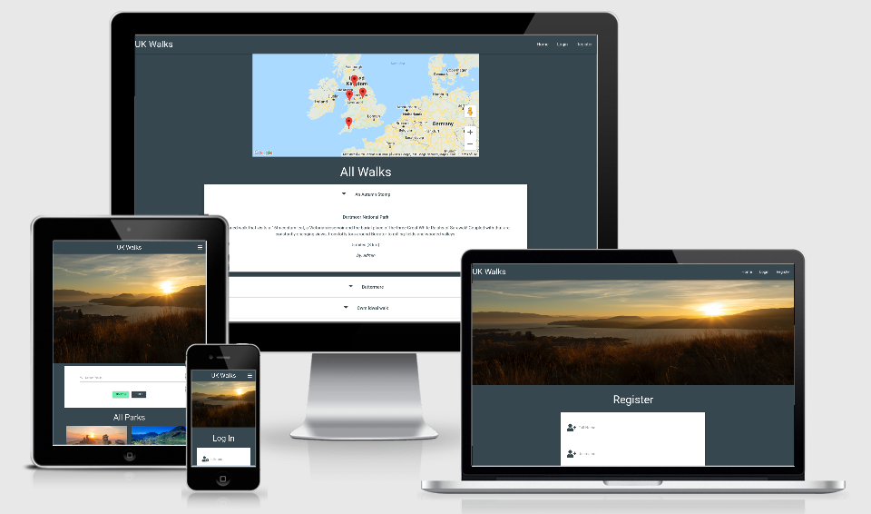

# UK Walks

(*Markdown Toc)
<small><i><a href='http://ecotrust-canada.github.io/markdown-toc/'>Table of contents generated with markdown-toc</a></i></small>

## Introduction

(*)

This is my third milestone project; Designed to exhibit my capabilities and skills in javascript, as a student
of Code Institute. (https://codeinstitute.net/)
The goal was to showcase my skills to potential employers/recruiters, on a topic that I'm deeply interested in.
My project allows users to discover new walks within the UK, inspiring them to get outside and enjoy the beautiful English countryside.

(*Pages and what's on them)

The website is colourful and engaging, drawing the user in with bright, bold images and standout text, which I hope entices them
to get planning thier next walking route.

A link to my website can be found [here](https://gwen-bradbury.github.io/MS3/

## UX

### Goals -

The purpose of the site is to provide a simple, straightforward format presenting information about some of the UK's best National Park walks.
My website is designed for people interested in walking in the UK, and im hopeful my website
will give them the motivation towards getting out into the countryside more often and visiting somewhere new.
The website is fully functional and interactive giving the user a positive experience as they move throught the pages.
I focused on a design that would be engaging and easy to navigate so users will continue to repeatedly visit and make use of the
features implimented within the app.

### Wireframes-

I have produced a mock up of all of my app's pages.

### Design

#### Design Process-

1. _Strategy Plane_ - From the onset I knew that my primary aim was to encourage people who enjoy walking to explore different UK National Parks in a way that was engaging and simple, therefore stimulating them to get back outdoors and into the countryside. My main focus thoughout this project has been to excute this aim. I started the UX process by making a list of user stories, which allowed me to visualise what would be necessary to satisy them.
2. _Scope Plane_ - Having decided the main aim for the project, I began outlining the key features that I wanted my website to have.
To do so, I focused on the Python and Javascript I would need to implement, as I knew this would be crucial to the aim of making the website interactive. This led me to decide that I wanted to focus on two key features: a registration form and login page, and a page for users to add walks to a list, with the added option to delete walks they've added if needed.
3. _Structure Plane_ - Once I had narrowed down the features I wanted to include, I formulated the structure of my design into 3 seperate pages:
4. _Skeleton Plane_ -
5. _Surface Plane_ -

- For my design to work, I knew that it would be important to create a theme that would keep the user interested. My first design decision was therefore to make the website as bright and colourful with images from the three National Parks I'm focusing on, to gain and keep thier attention.
- With this in mind, I began experimenting with my wireframes. I found it useful to generate a color scheme using coolors, which provided me with contrasting colours for my website and found images that complemented that colour scheme. I used figma to make mock ups of my websites pages.
- With the wireframes complete I began experimenting with the libraries and technologies I would use for the features within my app. I used a different workspace for the different technologies needed for each feature.

> Note: Throughout the design process, I kept referring back to my original 'Main Aims' and 'User Stories' to make sure that my project was developing as intended.

#### Colour Pallette-

I used coolors to generate my colour scheme-
